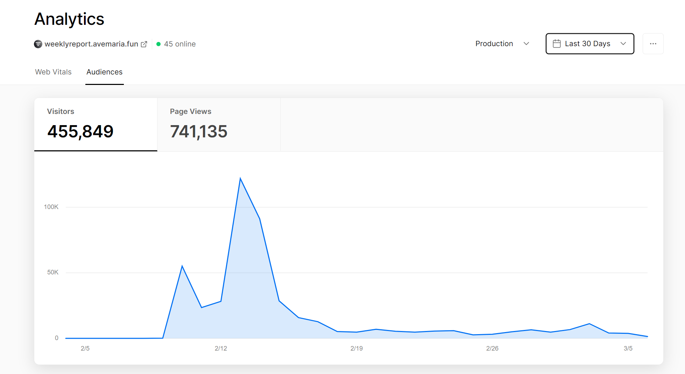
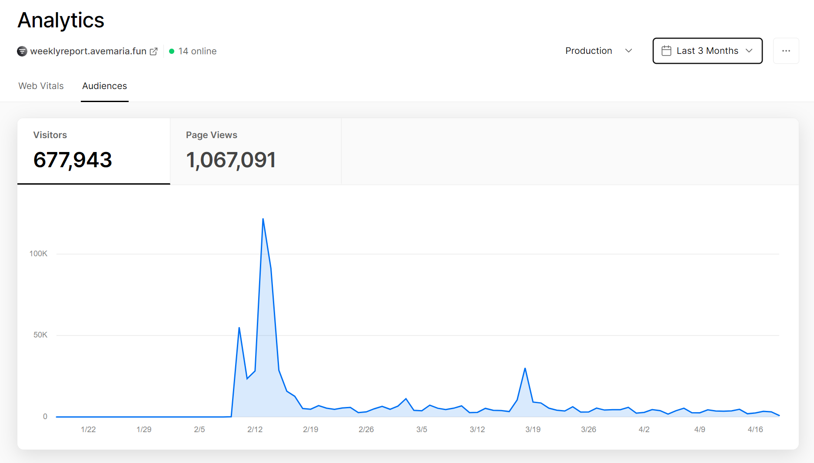

# [Weekly Report](https://weeklyreport.avemaria.fun/)

## [English](README_EN.md)

简单描述工作内容，帮你生成完整周报

[](https://weeklyreport.avemaria.fun/zh)

## ✨ 新特性

- 🔄 **多API源支持**: 支持 OpenAI、DeepSeek、Moonshot、智谱AI 等多种 API 源
- 🌐 **环境变量配置**: 通过环境变量灵活配置 API 源和模型
- 🚀 **Node.js 22 支持**: 升级到最新的依赖和 Node.js 版本
- ☁️ **Vercel 优化**: 保持完美的 Vercel 部署兼容性
- 🛡️ **错误处理**: 增强的错误处理和超时控制
- 📝 **TypeScript**: 完整的 TypeScript 支持

## 🔧 支持的API源

| 提供商 | 基础URL | 模型示例 | 说明 |
|--------|---------|----------|------|
| OpenAI | `https://api.openai.com/v1` | `gpt-3.5-turbo`, `gpt-4` | 官方 OpenAI API |
| DeepSeek | `https://api.deepseek.com/v1` | `deepseek-chat`, `deepseek-coder` | DeepSeek AI |
| Moonshot | `https://api.moonshot.cn/v1` | `moonshot-v1-8k`, `moonshot-v1-32k` | 月之暗面 |
| 智谱AI | `https://open.bigmodel.cn/api/paas/v4` | `glm-4`, `glm-3-turbo` | 智谱 GLM |
| 自定义 | 自定义URL | 自定义模型 | 任何兼容 OpenAI 格式的API |

## 🚀 快速开始

### 本地运行

1. **克隆项目**
```bash
git clone https://github.com/guaguaguaxia/weekly_report.git
cd weekly_report
```

2. **安装依赖**
```bash
npm install
```

3. **配置环境变量**
```bash
cp .env.example .env
```

编辑 `.env` 文件，配置你的 API 源：

```bash
# OpenAI (默认)
OPENAI_API_KEY=sk-your-openai-api-key
OPENAI_API_BASE=https://api.openai.com/v1
OPENAI_MODEL=gpt-3.5-turbo

# 或者使用 DeepSeek
# OPENAI_API_KEY=sk-your-deepseek-api-key
# OPENAI_API_BASE=https://api.deepseek.com/v1
# OPENAI_MODEL=deepseek-chat

# 其他配置
NEXT_PUBLIC_USE_USER_KEY=false
REQUEST_TIMEOUT=30000
MAX_TOKENS=2000
```

4. **启动开发服务器**
```bash
npm run dev
```

打开 `http://localhost:3000`


## ☁️ 部署到 Vercel

### 一键部署

[](https://vercel.com/new/clone?repository-url=https://github.com/guaguaguaxia/weekly_report&env=OPENAI_API_KEY,OPENAI_API_BASE,OPENAI_MODEL,NEXT_PUBLIC_USE_USER_KEY&project-name=weekly_report&repo-name=weekly_report)

### 手动部署

1. Fork 这个项目到你的 GitHub
2. 在 [Vercel](https://vercel.com) 中导入你的项目
3. 配置环境变量：

**必需的环境变量：**
```bash
OPENAI_API_KEY=your-api-key-here
NEXT_PUBLIC_USE_USER_KEY=false
```

**可选的环境变量：**
```bash
OPENAI_API_BASE=https://api.openai.com/v1
OPENAI_MODEL=gpt-3.5-turbo
REQUEST_TIMEOUT=30000
MAX_TOKENS=2000
```

### 使用脚本部署

```bash
# 运行部署检查脚本
chmod +x scripts/deploy.sh
./scripts/deploy.sh
```

## 🐳 Docker 部署

### 使用现有镜像

```bash
docker run -d -p 3000:3000 --name weekly_report \
  -e OPENAI_API_KEY=your-api-key \
  -e OPENAI_API_BASE=https://api.openai.com/v1 \
  -e OPENAI_MODEL=gpt-3.5-turbo \
  ihxrainbow/weekly_report-docker
```

### Docker Compose

```yaml
version: '3.8'
services:
  weekly_report:
    container_name: weekly_report
    ports:
      - '3000:3000'
    image: ihxrainbow/weekly_report-docker
    environment:
      - OPENAI_API_KEY=your-api-key
      - OPENAI_API_BASE=https://api.openai.com/v1
      - OPENAI_MODEL=gpt-3.5-turbo
      - NEXT_PUBLIC_USE_USER_KEY=false
      - REQUEST_TIMEOUT=30000
      - MAX_TOKENS=2000
    restart: unless-stopped
```

## 🔧 配置说明

### 环境变量详解

| 变量名 | 必需 | 默认值 | 说明 |
|--------|------|--------|------|
| `OPENAI_API_KEY` | 是* | - | API 密钥，支持逗号分隔多个密钥 |
| `OPENAI_API_BASE` | 否 | `https://api.openai.com/v1` | API 基础URL |
| `OPENAI_MODEL` | 否 | `gpt-3.5-turbo` | 使用的模型名称 |
| `NEXT_PUBLIC_USE_USER_KEY` | 否 | `false` | 是否允许用户输入自己的API密钥 |
| `REQUEST_TIMEOUT` | 否 | `30000` | 请求超时时间（毫秒） |
| `MAX_TOKENS` | 否 | `2000` | 最大生成token数 |

*当 `NEXT_PUBLIC_USE_USER_KEY=true` 时不必需

### API源配置示例

**OpenAI 官方：**
```bash
OPENAI_API_KEY=sk-your-openai-key
OPENAI_API_BASE=https://api.openai.com/v1
OPENAI_MODEL=gpt-3.5-turbo
```

**DeepSeek：**
```bash
OPENAI_API_KEY=sk-your-deepseek-key
OPENAI_API_BASE=https://api.deepseek.com/v1
OPENAI_MODEL=deepseek-chat
```

**Moonshot：**
```bash
OPENAI_API_KEY=sk-your-moonshot-key
OPENAI_API_BASE=https://api.moonshot.cn/v1
OPENAI_MODEL=moonshot-v1-8k
```

**智谱AI：**
```bash
OPENAI_API_KEY=your-zhipu-key
OPENAI_API_BASE=https://open.bigmodel.cn/api/paas/v4
OPENAI_MODEL=glm-4
```

<!-- https://www.seotraininglondon.org/gpt3-business-email-generator/ -->

## 一些数据
### 2023-03-06


### 2023-04-19



## 感谢

受 [TwtterBio](https://github.com/Nutlope/twitterbio) 和 [chat-simplifier](https://github.com/zhengbangbo/chat-simplifier) 启发.


