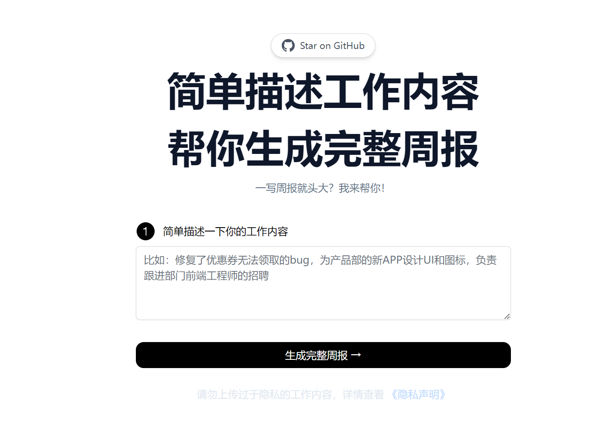

# [Weekly Report](https://weeklyreport.avemaria.fun/)

## [English](README_EN.md)

简单描述工作内容，帮你生成完整周报

[](https://weeklyreport.avemaria.fun/zh)

## ✨ 主要特性

- 🎨 **个性化设置**: 字体、主题、语言等自定义配置
- 🔄 **多API源支持**: OpenAI、DeepSeek、Moonshot、智谱AI 等
- 📅 **多种报告类型**: 支持日报、周报、月报一键切换
- 🚀 **多平台部署**: 支持 Vercel、Cloudflare Pages、GitHub Pages 一键部署
- 🔧 **调试工具**: 内置系统诊断和健康检查
- 🛡️ **隐私保护**: 数据不存储，支持自定义API密钥

## 🚀 快速开始

### 本地运行

```bash
# 1. 克隆项目
git clone https://github.com/laochenfei233/weeklyReportGPT.git
cd weeklyReportGPT

# 2. 安装依赖
npm install

# 3. 快速设置
npm run setup

# 4. 启动开发服务器
npm run dev
```

### 环境变量配置

复制 `.env.example` 为 `.env`，配置必要的环境变量：

```bash
OPENAI_API_KEY=your-api-key-here
NEXT_PUBLIC_USE_USER_KEY=false
```

📋 **详细配置**: 查看 [环境配置指南](../../wiki/Environment-Configuration)

## ☁️ 部署指南

### 🚀 一键部署到云平台

| 平台 | 一键部署 | 特点 |
|------|----------|------|
| **Vercel** | [](https://vercel.com/new/clone?repository-url=https://github.com/laochenfei233/weeklyReportGPT&env=OPENAI_API_KEY,NEXT_PUBLIC_USE_USER_KEY&project-name=weeklyReportGPT&repo-name=weeklyReportGPT) | 官方推荐，自动部署，免费额度充足 |
| **Cloudflare Pages** | [](https://deploy.pages.dev/button/github/laochenfei233/weeklyReportGPT) | 全球CDN，免费无限流量 |
| **GitHub Pages** | 手动部署 | 免费静态托管，适合个人项目 |

### 📋 部署方式对比

| 特性 | Vercel | Cloudflare Pages | GitHub Pages |
|------|--------|------------------|--------------|
| 免费额度 | 有限 | 无限 | 无限 |
| 全球CDN | ✅ | ✅ | ✅ |
| 自动部署 | ✅ | ✅ | ✅ |
| 无服务器API | ❌ | ❌ | ❌ |
| 客户端API调用 | ✅ | ✅ | ✅ |

> **注意**: Cloudflare Pages 和 GitHub Pages 部署使用客户端API调用模式，需要用户在使用时输入自己的API密钥。

### 🔧 各平台部署

#### Vercel 部署（推荐）

[](https://vercel.com/new/clone?repository-url=https://github.com/laochenfei233/weeklyReportGPT&env=OPENAI_API_KEY,NEXT_PUBLIC_USE_USER_KEY&project-name=weeklyReportGPT&repo-name=weeklyReportGPT)

在 Vercel 项目设置中添加：
- `OPENAI_API_KEY` = `your-api-key-here`
- `NEXT_PUBLIC_USE_USER_KEY` = `false`

🚀 **详细指南**: 查看 [Vercel 部署教程](../../wiki/Vercel-Deployment)

#### Cloudflare Pages 部署

[](https://deploy.pages.dev/button/github/laochenfei233/weeklyReportGPT)

使用步骤：
1. 点击上方按钮连接到 Cloudflare Pages
2. 设置项目名称
3. 构建命令：`npm run build`
4. 输出目录：`out`
5. 部署完成后配置自定义域名

🚀 **详细指南**: 查看 [Cloudflare Pages 部署](../../wiki/Cloudflare-Pages-Deployment)

#### GitHub Pages 部署

手动部署到 GitHub Pages：
1. Fork 本项目
2. 启用 GitHub Pages（Settings → Pages → Source: GitHub Actions）
3. 推送更改后自动部署

🚀 **详细指南**: 查看 [GitHub Pages 部署](../../wiki/GitHub-Pages-Deployment)

## 📖 使用指南

### 基本使用
1. 访问网站，在文本框中描述工作内容
2. 选择报告类型(日报/周报/月报)
3. 点击生成按钮，等待AI生成报告
4. 复制生成的报告到需要的地方

### 示例输入
```
本周完成了用户管理系统的开发，包括用户注册、登录、权限管理等功能。
修复了订单系统中的3个bug，提升了系统稳定性。
参与了2次技术评审会议，协助制定了新项目的技术方案。
```

### Token使用限制
- **默认限制**: 每用户1万Token（包括输入和输出）
- **解除限制**: 管理员登录或配置自定义API密钥

### 个性化设置
点击右上角齿轮图标 ⚙️ 进行配置：
- 主题切换（浅色/深色/自动）
- 字体和语言设置
- API配置和管理员登录

🔧 **详细使用指南**: 查看 [使用教程](../../wiki/Usage-Guide)

## 📚 完整文档

详细的使用指南和技术文档请查看我们的 [Wiki 文档](../../wiki)：

- [📖 使用指南](../../wiki/Usage-Guide) - 详细的使用教程和技巧
- [🔧 支持的API源](../../wiki/Supported-APIs) - 多种AI服务商配置说明
- [🚀 部署指南](../../wiki/Deployment-Guide) - 完整的部署说明和配置
- [🔍 故障排除](../../wiki/Troubleshooting) - 常见问题和解决方案
- [⚙️ 设置系统](../../wiki/Settings-System) - 个性化设置和主题配置
- [🔐 管理员登录](../../wiki/Admin-Login) - 验证码登录和管理员功能

## 🔒 隐私保护

- 您的输入内容不会被永久存储
- 仅在生成周报时临时处理数据
- 支持使用自己的API密钥增强隐私控制
- 详细信息请查看 [隐私政策](../../wiki/Privacy-Policy)

## 感谢

受 [TwtterBio](https://github.com/Nutlope/twitterbio) 和 [chat-simplifier](https://github.com/zhengbangbo/chat-simplifier) 启发.